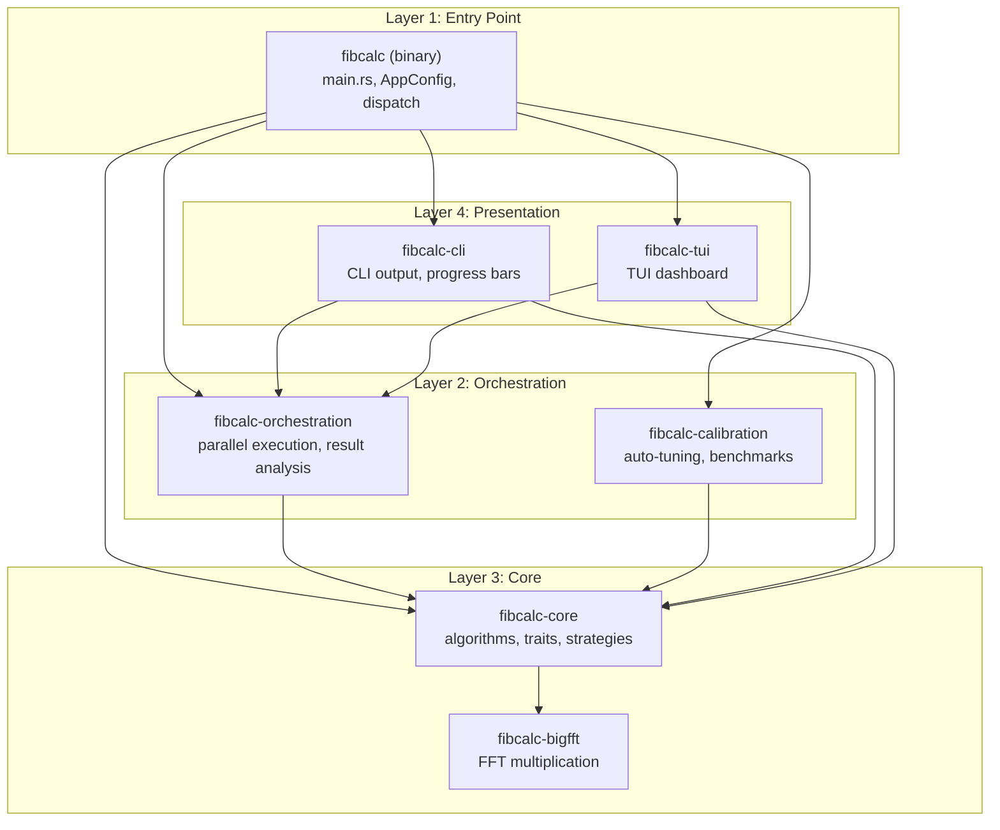
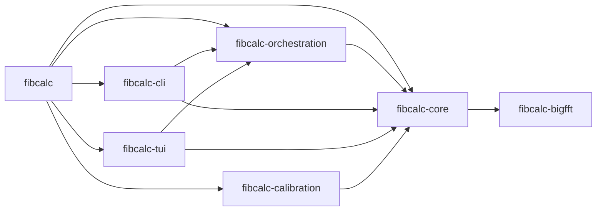
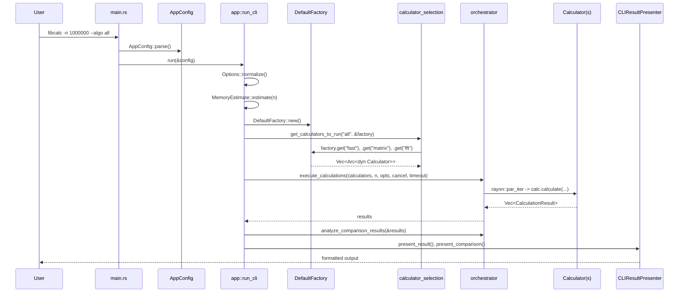
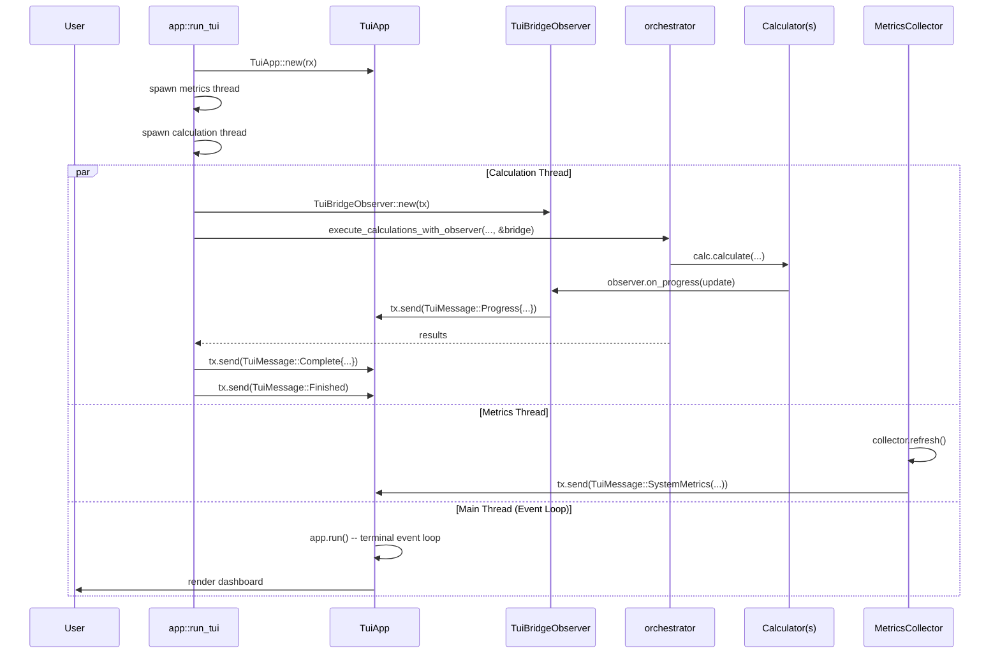

# Architecture

This document describes the internal architecture of FibCalc-rs, a high-performance Fibonacci calculator ported from Go (FibGo) to Rust.

## Table of Contents

- [High-Level Overview](#high-level-overview)
- [Four-Layer Architecture](#four-layer-architecture)
- [Workspace Crate Map](#workspace-crate-map)
- [Key Traits and Relationships](#key-traits-and-relationships)
- [Design Patterns](#design-patterns)
- [Data Flow](#data-flow)
- [Concurrency Model](#concurrency-model)
- [Memory Management](#memory-management)
- [Error Handling](#error-handling)
- [Configuration Precedence](#configuration-precedence)

---

## High-Level Overview

FibCalc-rs is a Cargo workspace of 7 crates (Rust 2021 edition, MSRV 1.80+) that implements three Fibonacci algorithms -- Fast Doubling, Matrix Exponentiation, and FFT-Based -- with CLI and TUI presentation modes, automatic calibration of algorithm thresholds, and cooperative cancellation.

```
                       +-------------------+
                       |     fibcalc       |    Binary entry point
                       |  (src/main.rs)    |    CLI parsing, dispatch
                       +--------+----------+
                                |
              +-----------------+-----------------+
              |                                   |
   +----------v-----------+           +-----------v-----------+
   | fibcalc-orchestration|           | fibcalc-calibration   |
   | Parallel execution   |           | Auto-tuning, adaptive |
   | Result aggregation   |           | benchmarks, profiles  |
   +----------+-----------+           +-----------------------+
              |
   +----------v-----------+
   |    fibcalc-core       |    Algorithms, traits, strategies,
   |                       |    observer, registry, thresholds,
   |                       |    memory budget
   +----------++-----------+
              ||
              |+--- fibcalc-bigfft    FFT multiplication,
              |     (Fermat numbers,  Fermat numbers, transform
              |      bump allocator)  cache, pools
              |
   +----------v-----------+----------v-----------+
   |    fibcalc-cli        |    fibcalc-tui       |
   | CLI output, progress  | TUI dashboard        |
   | shell completion      | (ratatui + Elm arch)  |
   +-----------------------+-----------------------+
```

### Technology Stack

| Concern | Technology |
|---------|-----------|
| Big integers | `num-bigint` (pure Rust, default) / `rug` (GMP, optional) |
| Parallelism | `rayon` (work-stealing), `crossbeam` (channels) |
| CLI | `clap` (derive mode) + `clap_complete` |
| TUI | `ratatui` + `crossterm` |
| Allocation | `bumpalo` (arena), thread-local pools |
| Synchronization | `parking_lot` (fast `RwLock`/`Mutex`) |
| Logging | `tracing` + `tracing-subscriber` |
| Error handling | `thiserror` (library crates), `anyhow` (binary) |
| Serialization | `serde` + `serde_json` (calibration profiles) |

---

## Four-Layer Architecture

The system is organized into four logical layers. Dependencies flow strictly downward.



### Layer 1: Entry Point (`fibcalc`)

**Crate:** `crates/fibcalc` (binary)

The binary entry point handles:

- **CLI parsing** via `AppConfig` (clap derive) in `config.rs`
- **Dispatch** in `app.rs`: routes to CLI mode, TUI mode, calibration mode, or shell completion generation
- **Error mapping** in `errors.rs`: translates `FibError` variants to exit codes
- **Tracing initialization** with `tracing-subscriber`

The `run()` function in `app.rs` is the central dispatcher:

```
run(&config)
  |-- config.completion? -> generate shell completion
  |-- config.calibrate?  -> run_calibration()
  |-- config.tui?        -> run_tui()
  |-- otherwise          -> run_cli()
```

### Layer 2: Orchestration

**Crate:** `crates/fibcalc-orchestration`

Coordinates parallel execution of multiple calculators:

- `orchestrator.rs` -- `execute_calculations()` runs calculators in parallel via `rayon::par_iter`, collects `CalculationResult` structs, and `analyze_comparison_results()` verifies cross-algorithm consistency
- `calculator_selection.rs` -- `get_calculators_to_run()` resolves `"all"` or a specific algorithm name via the `CalculatorFactory`
- `interfaces.rs` -- defines `ProgressReporter`, `ResultPresenter`, and `CalculationResult`

**Crate:** `crates/fibcalc-calibration`

Auto-tuning to determine optimal thresholds for the current hardware:

- `CalibrationEngine` supports `Full`, `Auto`, and `Cached` modes
- `microbench` module runs targeted benchmarks to find FFT crossover points and parallel overhead
- `adaptive` module provides quick threshold estimation
- Results are persisted as `CalibrationProfile` JSON files via the `io` module

### Layer 3: Core

**Crate:** `crates/fibcalc-core`

The algorithmic heart of the system. Contains:

- Three algorithm implementations: `OptimizedFastDoubling`, `MatrixExponentiation`, `FFTBasedCalculator`
- Trait hierarchy: `Calculator`, `CoreCalculator`, `Multiplier`, `DoublingStepExecutor`
- Strategy implementations: `KaratsubaStrategy`, `ParallelKaratsubaStrategy`, `FFTOnlyStrategy`, `AdaptiveStrategy`
- Observer pattern: `ProgressObserver`, `ProgressSubject`, `FrozenObserver`
- Factory/Registry: `DefaultFactory` with `RwLock<HashMap>` cache
- Configuration: `Options`, `constants`, `dynamic_threshold`
- Memory management: `memory_budget`, `arena`

**Crate:** `crates/fibcalc-bigfft`

FFT-based big number multiplication, ported from Go's `internal/bigfft`:

- Public API: `mul()`, `sqr()`, `mul_to()`, `sqr_to()`
- Fermat number transform for modular arithmetic
- Transform cache (`fft_cache`) for reusing precomputed roots
- Bump allocator (`bump`) using `bumpalo` for FFT temporaries
- Memory pool (`pool`) for `BigUint` recycling

### Layer 4: Presentation

**Crate:** `crates/fibcalc-cli`

CLI output formatting:

- `CLIResultPresenter` -- implements `ResultPresenter` for terminal output
- `CLIProgressReporter` -- implements `ProgressReporter` using stderr
- `output` module -- number formatting, duration formatting, file output
- `completion` module -- shell completion generation

**Crate:** `crates/fibcalc-tui`

Interactive TUI dashboard using the Elm architecture:

- `TuiApp` (model) -- central state machine processing `TuiMessage` events
- `TuiBridgeObserver` -- implements `ProgressObserver` to bridge core progress into TUI messages via `crossbeam_channel`
- `TUIProgressReporter` / `TUIResultPresenter` -- implements orchestration traits for TUI
- UI components: `header`, `footer`, `chart`, `sparkline`, `logs`, `metrics`
- `MetricsCollector` -- gathers system metrics (CPU, memory) via `sysinfo`

---

## Workspace Crate Map

### 7 Crates with Inter-Crate Dependencies

| Crate | Type | Depends On |
|-------|------|-----------|
| `fibcalc` | bin | `fibcalc-core`, `fibcalc-orchestration`, `fibcalc-cli`, `fibcalc-tui`, `fibcalc-calibration` |
| `fibcalc-core` | lib | `fibcalc-bigfft` |
| `fibcalc-bigfft` | lib | (none -- leaf crate) |
| `fibcalc-orchestration` | lib | `fibcalc-core` |
| `fibcalc-cli` | lib | `fibcalc-core`, `fibcalc-orchestration` |
| `fibcalc-tui` | lib | `fibcalc-core`, `fibcalc-orchestration` |
| `fibcalc-calibration` | lib | `fibcalc-core` |



### Key Source Files

| File | Purpose |
|------|---------|
| `crates/fibcalc/src/main.rs` | Binary entry point, tracing init |
| `crates/fibcalc/src/app.rs` | Application dispatch (CLI/TUI/calibration) |
| `crates/fibcalc/src/config.rs` | `AppConfig` with clap derive |
| `crates/fibcalc/src/errors.rs` | `FibError` to exit code mapping |
| `crates/fibcalc-core/src/calculator.rs` | `Calculator`, `CoreCalculator`, `FibCalculator` |
| `crates/fibcalc-core/src/strategy.rs` | `Multiplier`, `DoublingStepExecutor`, all strategies |
| `crates/fibcalc-core/src/observer.rs` | `ProgressObserver`, `ProgressSubject`, `FrozenObserver` |
| `crates/fibcalc-core/src/registry.rs` | `CalculatorFactory`, `DefaultFactory` |
| `crates/fibcalc-core/src/fastdoubling.rs` | `OptimizedFastDoubling` algorithm |
| `crates/fibcalc-core/src/matrix.rs` | `MatrixExponentiation` algorithm |
| `crates/fibcalc-core/src/fft_based.rs` | `FFTBasedCalculator` algorithm |
| `crates/fibcalc-core/src/options.rs` | `Options` struct with threshold defaults |
| `crates/fibcalc-core/src/constants.rs` | Thresholds, `FIB_TABLE`, exit codes |
| `crates/fibcalc-core/src/progress.rs` | `ProgressUpdate`, `CancellationToken` |
| `crates/fibcalc-core/src/memory_budget.rs` | `MemoryEstimate`, memory limit parsing |
| `crates/fibcalc-bigfft/src/fft.rs` | `mul()`, `sqr()` public API |
| `crates/fibcalc-bigfft/src/fermat.rs` | Fermat number arithmetic |
| `crates/fibcalc-orchestration/src/orchestrator.rs` | `execute_calculations()`, `analyze_comparison_results()` |
| `crates/fibcalc-orchestration/src/interfaces.rs` | `ProgressReporter`, `ResultPresenter`, `CalculationResult` |
| `crates/fibcalc-orchestration/src/calculator_selection.rs` | `get_calculators_to_run()` |
| `crates/fibcalc-cli/src/presenter.rs` | `CLIResultPresenter`, `CLIProgressReporter` |
| `crates/fibcalc-tui/src/bridge.rs` | `TuiBridgeObserver`, TUI presenters |
| `crates/fibcalc-tui/src/model.rs` | `TuiApp` state machine |
| `crates/fibcalc-calibration/src/calibration.rs` | `CalibrationEngine`, `CalibrationMode` |

---

## Key Traits and Relationships

### Trait Hierarchy

```mermaid
classDiagram
    class Calculator {
        <<trait>>
        +calculate(cancel, observer, calc_index, n, opts) Result~BigUint, FibError~
        +name() &str
    }

    class CoreCalculator {
        <<trait>>
        +calculate_core(cancel, observer, calc_index, n, opts) Result~BigUint, FibError~
        +name() &str
    }

    class Multiplier {
        <<trait>>
        +multiply(a, b) BigUint
        +square(a) BigUint
        +name() &str
    }

    class DoublingStepExecutor {
        <<trait>>
        +execute_doubling_step(fk, fk1) (BigUint, BigUint)
    }

    class ProgressObserver {
        <<trait>>
        +on_progress(update: &ProgressUpdate)
        +freeze() FrozenObserver
    }

    class CalculatorFactory {
        <<trait>>
        +get(name) Result~Arc~dyn Calculator~, FibError~
        +available() Vec~&str~
    }

    class ProgressReporter {
        <<trait>>
        +report(update: &ProgressUpdate)
        +complete()
    }

    class ResultPresenter {
        <<trait>>
        +present_result(algorithm, n, result, duration, details)
        +present_comparison(results)
        +present_error(error)
    }

    DoublingStepExecutor --|> Multiplier : extends

    Calculator <|.. FibCalculator : implements
    CoreCalculator <|.. OptimizedFastDoubling : implements
    CoreCalculator <|.. MatrixExponentiation : implements
    CoreCalculator <|.. FFTBasedCalculator : implements

    Multiplier <|.. KaratsubaStrategy : implements
    Multiplier <|.. ParallelKaratsubaStrategy : implements
    Multiplier <|.. FFTOnlyStrategy : implements
    Multiplier <|.. AdaptiveStrategy : implements
    DoublingStepExecutor <|.. KaratsubaStrategy : implements
    DoublingStepExecutor <|.. ParallelKaratsubaStrategy : implements
    DoublingStepExecutor <|.. FFTOnlyStrategy : implements
    DoublingStepExecutor <|.. AdaptiveStrategy : implements

    ProgressObserver <|.. NoOpObserver : implements
    ProgressObserver <|.. TuiBridgeObserver : implements

    CalculatorFactory <|.. DefaultFactory : implements

    ProgressReporter <|.. CLIProgressReporter : implements
    ProgressReporter <|.. TUIProgressReporter : implements
    ProgressReporter <|.. NullProgressReporter : implements

    ResultPresenter <|.. CLIResultPresenter : implements
    ResultPresenter <|.. TUIResultPresenter : implements
```



### Trait Descriptions

**`Calculator`** (defined in `fibcalc-core/src/calculator.rs`)

The public interface consumed by the orchestration layer. Requires `Send + Sync`. Methods:
- `calculate(&self, cancel, observer, calc_index, n, opts) -> Result<BigUint, FibError>`
- `name(&self) -> &str`

**`CoreCalculator`** (defined in `fibcalc-core/src/calculator.rs`)

The internal interface implemented by algorithm structs. Not exposed outside `fibcalc-core`. Wrapped by `FibCalculator` which adds the fast path for n <= 93 and cancellation checking. Methods:
- `calculate_core(&self, cancel, observer, calc_index, n, opts) -> Result<BigUint, FibError>`
- `name(&self) -> &str`

**`Multiplier`** (defined in `fibcalc-core/src/strategy.rs`)

Narrow interface for big integer multiplication following the Interface Segregation Principle. Methods:
- `multiply(&self, a: &BigUint, b: &BigUint) -> BigUint`
- `square(&self, a: &BigUint) -> BigUint` (default: delegates to `multiply`)
- `name(&self) -> &str`

**`DoublingStepExecutor`** (defined in `fibcalc-core/src/strategy.rs`)

Extends `Multiplier` with the optimized Fast Doubling step. Methods:
- `execute_doubling_step(&self, fk: &BigUint, fk1: &BigUint) -> (BigUint, BigUint)`

Computes F(2k) and F(2k+1) from F(k) and F(k+1) using the identities:
- F(2k)   = F(k) * (2*F(k+1) - F(k))
- F(2k+1) = F(k)^2 + F(k+1)^2

**`ProgressObserver`** (defined in `fibcalc-core/src/observer.rs`)

Observer trait for progress updates with a lock-free snapshot mechanism. Methods:
- `on_progress(&self, update: &ProgressUpdate)` -- receives a progress event
- `freeze(&self) -> FrozenObserver` -- creates an atomic snapshot for hot loops

**`CalculatorFactory`** (defined in `fibcalc-core/src/registry.rs`)

Factory trait for lazy creation and caching of calculator instances. Methods:
- `get(&self, name: &str) -> Result<Arc<dyn Calculator>, FibError>`
- `available(&self) -> Vec<&str>`

**`ProgressReporter`** and **`ResultPresenter`** (defined in `fibcalc-orchestration/src/interfaces.rs`)

Presentation-layer traits for output formatting. `ProgressReporter` handles live progress updates; `ResultPresenter` handles final result display and algorithm comparison tables.

---

## Design Patterns

### 1. Decorator Pattern

**`FibCalculator`** wraps any `CoreCalculator` to add cross-cutting concerns:

```
FibCalculator { inner: Arc<dyn CoreCalculator> }
    |
    +-- Fast path: if n <= 93, return FIB_TABLE[n] (precomputed u64 lookup)
    +-- Cancellation check: if cancel.is_cancelled(), return Err(Cancelled)
    +-- Delegate: inner.calculate_core(...)
```

This keeps algorithm implementations focused on computation while the decorator handles:
- The precomputed table lookup for F(0) through F(93)
- Cancellation checking before delegating to expensive computation
- Progress completion notification for the fast path

### 2. Factory + Registry Pattern

**`DefaultFactory`** implements lazy creation with `RwLock<HashMap>` caching:

```rust
// Read path (fast, concurrent)
cache.read().get(name) -> Some(Arc::clone)

// Write path (only on first access)
create_calculator(name) -> cache.write().insert(name, Arc::clone)
```

Registered calculators: `"fast"` / `"fastdoubling"`, `"matrix"`, `"fft"`.

Each is created as `FibCalculator::new(Arc::new(CoreImpl::new()))`, wrapping the core algorithm in the decorator.

### 3. Strategy + Interface Segregation

The `Multiplier` trait is a narrow ISP-compliant interface (multiply/square only). `DoublingStepExecutor` extends it with the composite doubling step operation.

Four strategy implementations:

| Strategy | Description | When Used |
|----------|-------------|-----------|
| `KaratsubaStrategy` | Delegates to `num-bigint`'s built-in `*` operator | Small numbers, default |
| `ParallelKaratsubaStrategy` | Uses `rayon::join` for concurrent squarings when bits >= threshold | Large numbers above `parallel_threshold` |
| `FFTOnlyStrategy` | Delegates to `fibcalc_bigfft::mul/sqr` | Very large numbers |
| `AdaptiveStrategy` | Switches between Karatsuba and FFT based on operand bit length | Automatic selection |

Strategy selection is driven by the `Options.parallel_threshold` and `Options.fft_threshold` values. The `OptimizedFastDoubling` algorithm uses `ParallelKaratsubaStrategy` directly.

### 4. Observer Pattern with Lock-Free Freeze

The observer pattern supports high-frequency progress reporting in hot computation loops:

```
ProgressSubject
    |-- observers: RwLock<Vec<Arc<dyn ProgressObserver>>>
    |-- notify(&update) -> iterates observers under read lock
    |-- register(observer) -> adds under write lock

ProgressObserver
    |-- on_progress(&update) -> receive update
    |-- freeze() -> FrozenObserver (lock-free snapshot)

FrozenObserver
    |-- progress: Arc<AtomicU64>   (f64 stored as bits)
    |-- threshold: f64              (minimum change to report)
    |-- should_report(new) -> bool  (check if delta >= threshold)
    |-- update(new)                 (atomic store)
```

The `FrozenObserver` avoids lock contention in the inner loop of algorithm computation. The default `PROGRESS_REPORT_THRESHOLD` is 1% (0.01), so updates are only sent when progress changes by at least 1 percentage point.

### 5. Arena Allocation

`bumpalo::Bump` arenas are used in `fibcalc-bigfft` for FFT temporaries. The arena allocates memory linearly and frees everything at once when dropped, avoiding individual deallocation overhead during the many small allocations in FFT butterfly operations.

### 6. Zero-Copy Result Return

Algorithms use `std::mem::take` and `std::mem::replace` to extract results without copying:

```rust
// In OptimizedFastDoubling::execute_doubling_loop:
// Conditional addition step -- rotate pointers instead of copying
let sum = &state.fk + &state.fk1;
state.fk = std::mem::replace(&mut state.fk1, sum);

// Final result extraction -- take ownership without clone
Ok(std::mem::take(&mut state.fk))
```

### 7. Thread-Local Object Pooling

`OptimizedFastDoubling` uses thread-local pools for `CalculationState` objects:

```rust
thread_local! {
    static CALC_STATE_POOL: RefCell<Vec<CalculationState>> = const { RefCell::new(Vec::new()) };
}
```

States are acquired before computation and returned afterward, avoiding repeated allocation of the five `BigUint` temporaries (fk, fk1, t1, t2, t3). A `CalculationStatePool` with `parking_lot::Mutex` is also available for cross-thread pooling via Rayon work-stealing.

---

## Data Flow

### CLI Mode



### TUI Mode



### Calculation Pipeline

For a single algorithm invocation, the call chain is:

```
Calculator::calculate()                   [FibCalculator -- decorator]
  |-- n <= 93? -> return FIB_TABLE[n]    [fast path]
  |-- cancel.is_cancelled()? -> Err      [cancellation check]
  +-- CoreCalculator::calculate_core()   [algorithm impl]
        |
        +-- OptimizedFastDoubling:
        |     tl_acquire_state()          [thread-local pool]
        |     observer.freeze()           [lock-free snapshot]
        |     for bit in MSB..LSB:
        |       strategy.execute_doubling_step(fk, fk1)
        |       conditional addition with mem::replace
        |       frozen.should_report() -> observer.on_progress()
        |     mem::take(&mut state.fk)    [zero-copy return]
        |     tl_release_state()          [return to pool]
        |
        +-- MatrixExponentiation:
        |     matrix power via repeated squaring
        |
        +-- FFTBasedCalculator:
              Fast Doubling with FFTOnlyStrategy
              (delegates multiply/square to fibcalc_bigfft)
```

---

## Concurrency Model

FibCalc-rs uses **synchronous, CPU-bound parallelism**. There is no async runtime (no tokio).

### Rayon for Computation

- **Inter-algorithm parallelism**: When `--algo all` is specified, `execute_calculations()` runs all three algorithms concurrently via `rayon::par_iter`
- **Intra-algorithm parallelism**: `ParallelKaratsubaStrategy::execute_doubling_step()` uses `rayon::join` to parallelize the three independent multiplications (one multiply, two squarings) when operand bits exceed `parallel_threshold`

```rust
// In ParallelKaratsubaStrategy::execute_doubling_step:
if max_bits >= self.parallel_threshold {
    let ((fk_sq, fk1_sq), f2k) = rayon::join(
        || rayon::join(|| fk * fk, || fk1 * fk1),
        || fk * &t,
    );
    ...
}
```

### Crossbeam for Communication

- `crossbeam_channel::unbounded` channels connect the calculation thread to the TUI event loop
- `TuiMessage` enum carries progress updates, completion events, system metrics, log messages, errors, and control signals

### Cooperative Cancellation

`CancellationToken` uses `Arc<AtomicU64>` for lock-free cancellation propagation:

```rust
pub struct CancellationToken {
    cancelled: Arc<AtomicU64>,
}
```

- `cancel()` stores `1` with `Ordering::Relaxed`
- `is_cancelled()` loads with `Ordering::Relaxed`
- `check_cancelled()` returns `Err(FibError::Cancelled)` if cancelled

Algorithm loops check cancellation at each doubling step. The `TimeoutCancellationToken` extends this with an `Instant` deadline, returning `Err(FibError::Timeout)` when the deadline passes.

### Thread Architecture in TUI Mode

```
Main Thread         -- TuiApp::run() terminal event loop
Calculation Thread  -- std::thread::spawn, runs execute_calculations_with_observer
Metrics Thread      -- std::thread::spawn, polls sysinfo every 1 second
Rayon Pool          -- work-stealing threads for parallel computation
```

All threads share the `CancellationToken` (via `Arc`) and communicate through `crossbeam_channel`.

---

## Memory Management

### Memory Budget

Before starting a computation, `MemoryEstimate::estimate(n)` predicts memory usage:

```
result_bytes = ceil(n * 0.6942 / 8)     // F(n) has ~n*log2(phi) bits
temp_bytes   = result_bytes * 5          // 5 BigUint temporaries for Fast Doubling
total_bytes  = result_bytes + temp_bytes
```

If a `--memory-limit` is set, the estimate is checked against the limit before proceeding.

### Allocation Strategies

| Allocation Strategy | Where Used | Purpose |
|-------------------|------------|---------|
| Thread-local `Vec<CalculationState>` pool | `OptimizedFastDoubling` | Reuse BigUint temporaries across computations |
| `CalculationStatePool` (Mutex-protected) | Cross-thread pooling | Rayon work-stealing compatible |
| `bumpalo::Bump` arena | `fibcalc-bigfft` | Bulk allocation/deallocation for FFT temporaries |
| `BigUint` pools (`fibcalc-bigfft/pool`) | FFT multiplication | Recycle large BigUint buffers |
| Stack allocation | Small intermediates | Preferred for values that do not escape |

### Zero-Copy Techniques

- `std::mem::take(&mut state.fk)` extracts the result BigUint without cloning, leaving a zero in its place
- `std::mem::replace(&mut state.fk1, sum)` rotates values between variables without allocation
- These are used in the inner loop of the Fast Doubling algorithm for maximum efficiency

---

## Error Handling

### Error Type

`FibError` (defined in `fibcalc-core/src/calculator.rs`) is the central error type, derived with `thiserror`:

```rust
#[derive(Debug, thiserror::Error)]
pub enum FibError {
    #[error("calculation error: {0}")]
    Calculation(String),

    #[error("configuration error: {0}")]
    Config(String),

    #[error("calculation cancelled")]
    Cancelled,

    #[error("calculation timed out after {0}")]
    Timeout(String),

    #[error("result mismatch between algorithms")]
    Mismatch,

    #[error("overflow computing F({0}): result exceeds {1} capacity")]
    Overflow(u64, &'static str),

    #[error("invalid input: {0}")]
    InvalidInput(String),
}
```

### Error Propagation

| Layer | Error Handling |
|-------|--------------|
| Library crates | Return `Result<T, FibError>` using `thiserror` |
| Binary (`fibcalc`) | Uses `anyhow::Result` for contextual error wrapping |
| Exit codes | Mapped in `errors.rs`: Calculation/Overflow/InvalidInput=1, Timeout=2, Mismatch=3, Config=4, Cancelled=130 |

### Exit Codes

| Code | Meaning | `FibError` Variant |
|------|---------|-------------------|
| 0 | Success | -- |
| 1 | Generic error | `Calculation`, `Overflow`, `InvalidInput` |
| 2 | Timeout | `Timeout` |
| 3 | Result mismatch | `Mismatch` |
| 4 | Configuration error | `Config` |
| 130 | Cancelled (Ctrl+C) | `Cancelled` |

---

## Configuration Precedence

Configuration values are resolved with the following precedence (highest to lowest):

```
1. CLI flags          (e.g., --threshold 8192)
2. Environment vars   (e.g., FIBCALC_N=1000000)
3. Calibration profile (.fibcalc_calibration.json)
4. Static defaults    (constants.rs)
```

### Default Thresholds

| Threshold | Default Value | Purpose |
|-----------|--------------|---------|
| `DEFAULT_PARALLEL_THRESHOLD` | 4,096 bits | Below this, multiplication is sequential |
| `DEFAULT_FFT_THRESHOLD` | 500,000 bits | Below this, Karatsuba is used instead of FFT |
| `DEFAULT_STRASSEN_THRESHOLD` | 3,072 bits | Strassen multiplication crossover |
| `PROGRESS_REPORT_THRESHOLD` | 0.01 (1%) | Minimum progress delta to trigger a report |
| `MAX_FIB_U64` | 93 | Largest n where F(n) fits in u64 (fast path) |

### Options Normalization

`Options::normalize()` replaces zero-valued thresholds with the corresponding defaults from `constants.rs`. This allows CLI flags with value `0` to mean "use the default" (or the calibrated value).

### Calibration Profiles

`CalibrationProfile` is serialized as JSON and stored in `.fibcalc_calibration.json`. It includes:
- Threshold values (parallel, FFT, Strassen)
- CPU model and fingerprint (for cache validation)
- Number of cores
- Timestamp

When loading a cached profile, the engine validates version compatibility, threshold validity, and CPU fingerprint match before using the cached values.

### Cargo Features

| Feature | Description |
|---------|------------|
| `default` | Pure Rust, no system dependencies |
| `gmp` | GMP support via `rug` crate (LGPL, requires `libgmp`) |
| `simd` | Explicit SIMD optimizations (auto-detection by default) |
